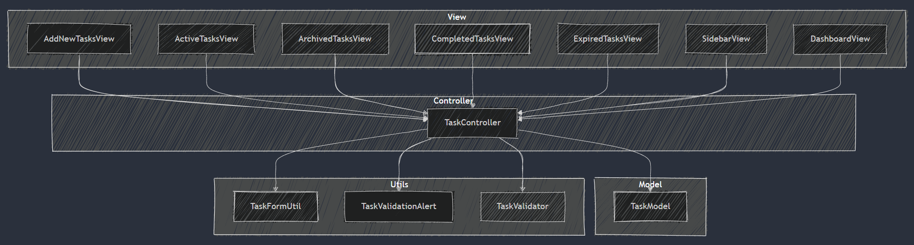
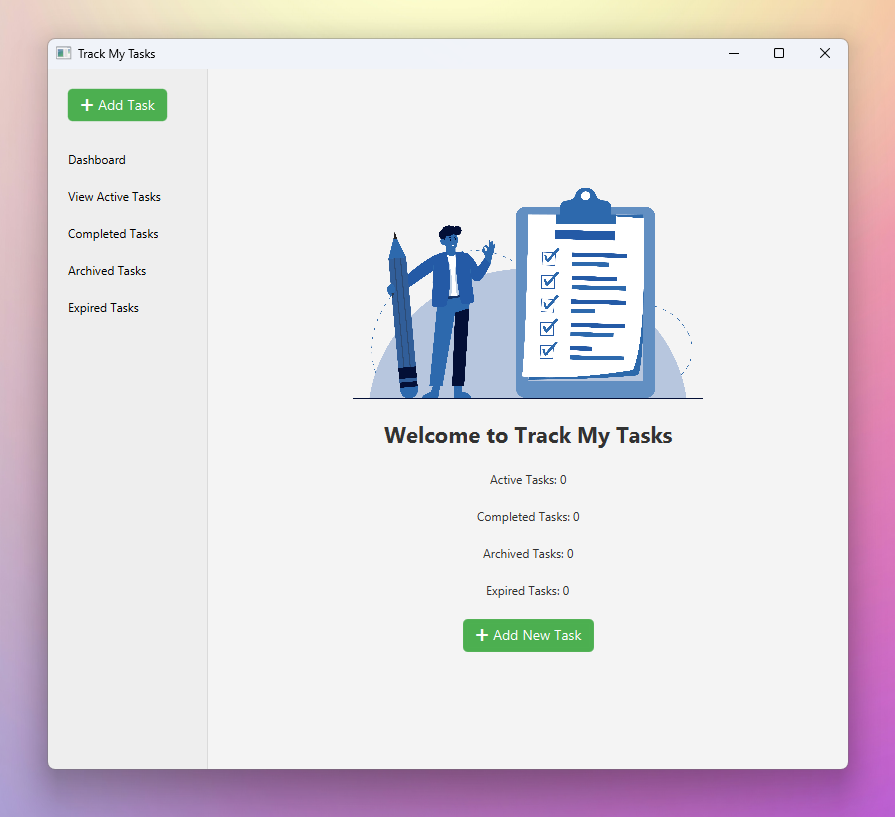
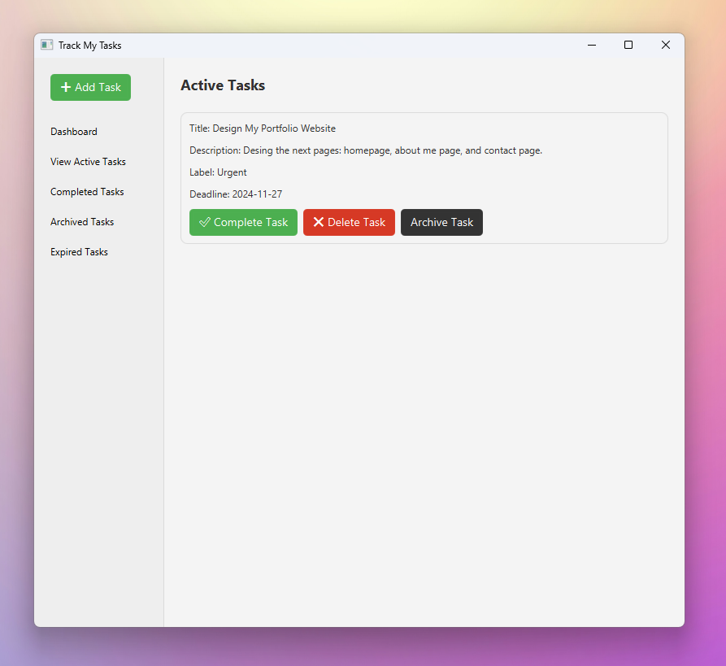
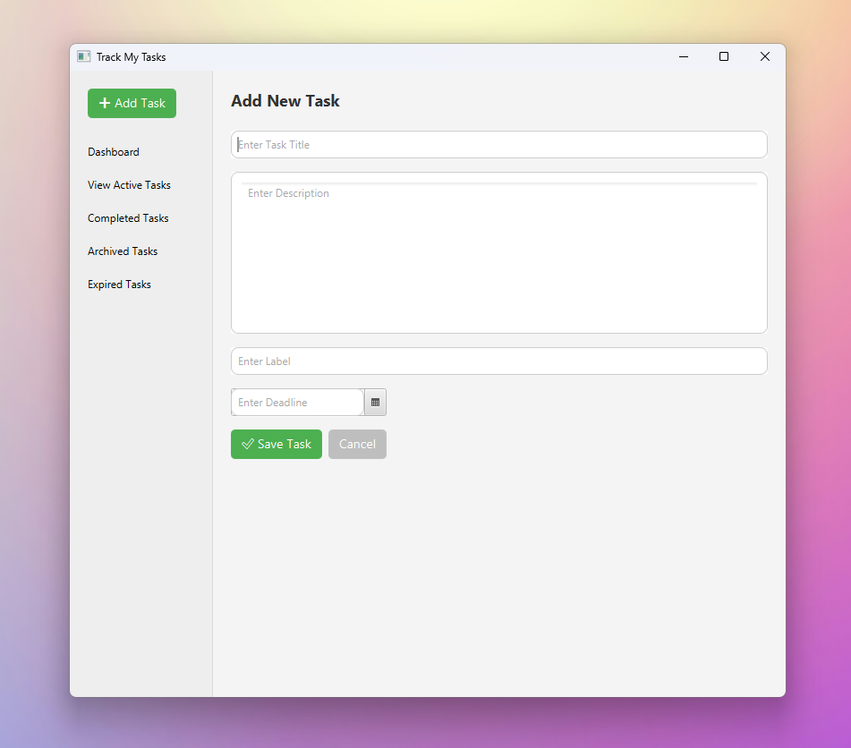
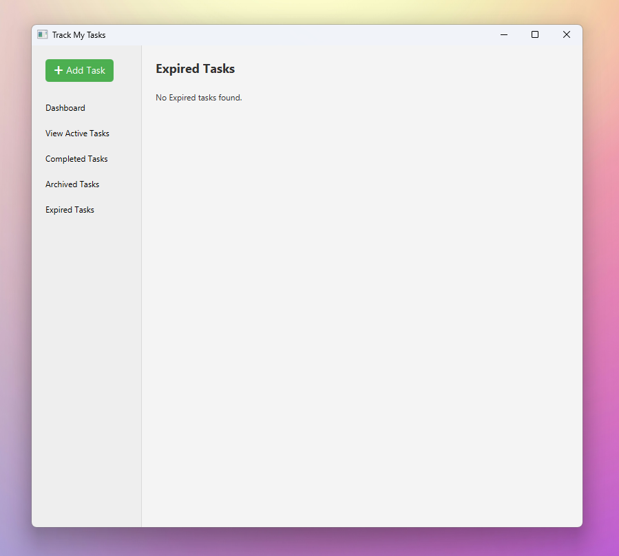
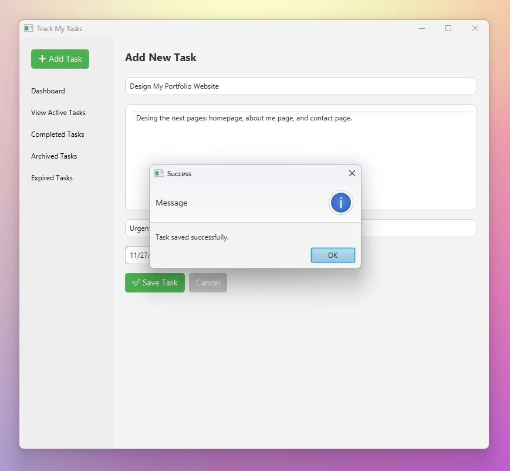

<div align="center">

<h1>Track My Tasks - JAVA Assignment</h1>

Track My Tasks is a simple task management desktop application built using JavaFX. It was built as part of an assignment and is **not intended for real-world use**. It serves as an educational example to demonstrate how to structure a simple application using the MVC architecture.

</div>

---

## ⚠️ IMPORTANT NOTES

- **No Data Persistence**: This application does not use any database or storage mechanism. Once the app is closed, **all data will be lost**.
- **Educational Purpose Only**: This app is built for an assignment and **not intended for real-world use**.

---

## TOC:

- [⚠️ IMPORTANT NOTES](#️-important-notes)
- [TOC:](#toc)
- [Installation \& Usage](#installation--usage)
- [Features](#features)
- [Project Structure](#project-structure)
  - [MVC Architecture:](#mvc-architecture)
  - [Utilities:](#utilities)
- [Screenshots](#screenshots)
  - [Dashboard](#dashboard)
  - [Active Tasks View](#active-tasks-view)
  - [Add New Task](#add-new-task)
  - [Expired Tasks](#expired-tasks)
  - [Task Saved Alert](#task-saved-alert)
- [WHat Can App Do](#what-can-app-do)
- [Technologies Used](#technologies-used)

---

## Installation & Usage

1. **Clone App**:
   ```bash
   git clone https://github.com/khaledsAlshibani/java-tasks-tracker-app.git
   ```
   
2. Run app in IDE supports Java (I used Netbeans IDE 22), and ensure that JavaFX is installed.

## Features

- **Add New Task**: Create new tasks by entering a title, description, label, and deadline.
- **Manage Tasks**: Complete, delete, and archive tasks directly from the active tasks view.
- **View Archived Tasks**: Access archived tasks with the ability to unarchive or delete them.
- **View Expired Tasks**: Easily see tasks that have passed their deadlines.
- **Task Validation**: Ensures task title, label, and deadlines are entered correctly.

## Project Structure

### MVC Architecture:

The project is structured according to the **MVC pattern**, with a focus on separation of concerns:
1. **Model**: Contains the task data and logic (`TaskModel`).
2. **View**: Handles the user interface, including the task views and input forms (`View` package).
3. **Controller**: Manages interaction between the model and the view (`TaskController`).



### Utilities:

Additional utility classes are placed in the `utils` package for reusability and clean code:
- **TaskFormUtil**: Handles form resets.
- **TaskValidationAlert**: Displays validation alerts.
- **TaskValidator**: Validates input data for tasks.

## Screenshots

### Dashboard



### Active Tasks View



### Add New Task



### Expired Tasks



### Task Saved Alert



## WHat Can App Do

1. **Add a New Task**: Navigate to the "Add New Task" view and fill in the required details, then click "Save Task".
2. **Manage Active Tasks**: From the "Active Tasks" view, complete, delete, or archive tasks.
3. **View Archived or Expired Tasks**: Navigate to the "Archived Tasks" or "Expired Tasks" views to manage or review tasks.

## Technologies Used

- **Java**: For the logic and data management.
- **JavaFX**: For the UI.
- **CSS**: For Styling.
